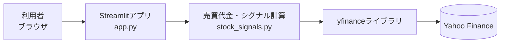
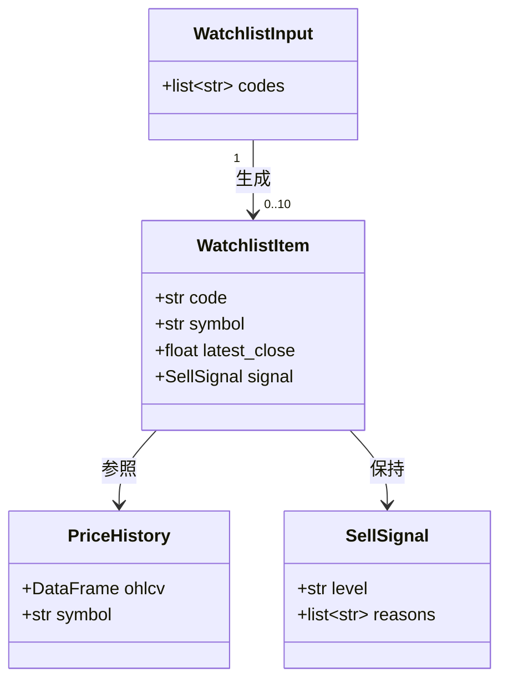
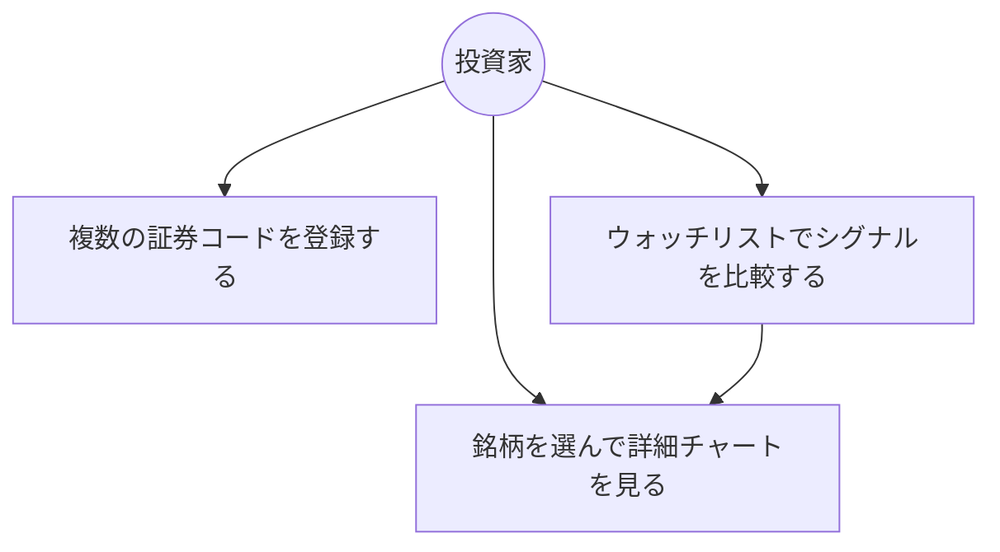
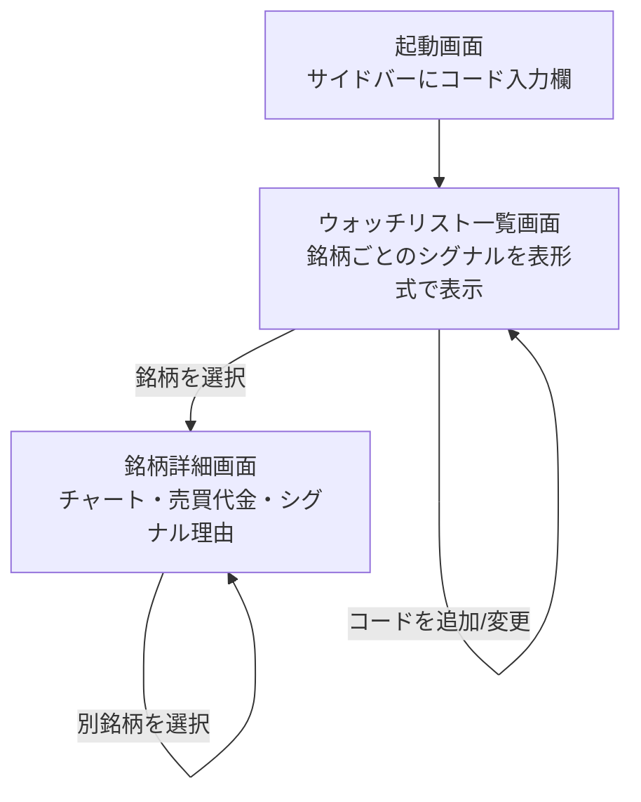

# 機能設計書

## システム構成図
本アプリは単一のStreamlitプロセスとして動作し、永続的なデータベースやバックエンドAPIは持たない。株価データは都度yfinance経由でYahoo Financeから取得する。



## 機能ごとのアーキテクチャ

### 1. ウォッチリスト入力・一覧表示機能
* サイドバーで証券コードを複数(最大50件)まとめて入力する(カンマまたは改行区切り)
* 入力されたコードごとに `stock_signals.py` の関数を呼び出し、シグナルを算出する
* 全銘柄のシグナルをメイン画面上部の一覧テーブルにまとめ、シグナルの強い順に並び替えて表示する
* 一部銘柄の取得に失敗しても、その銘柄のみエラー表示とし、他銘柄の一覧表示は継続する

### 2. 銘柄詳細表示機能
* 一覧から1銘柄を選択すると、その銘柄の詳細(ローソク足チャート・移動平均線・売買代金チャート・直近20営業日データ・シグナル判定理由)を表示する
* 初期選択銘柄は、一覧の中で最もシグナルが強い銘柄とする

## データモデル定義
本アプリはDBを持たず、すべてメモリ上のデータ構造として扱う(ページを閉じる・再読み込みすると消える)。



* `WatchlistInput.codes`: ユーザー入力を分割・トリム・重複除去した証券コードのリスト(最大50件)。上限超過時はUI上でエラーメッセージを表示する。
* `PriceHistory`: `stock_signals.fetch_price_history` で取得したOHLCVデータフレームに、`compute_indicators` で算出した列(売買代金・移動平均等)を追加したもの。
* `SellSignal`: 既存の `stock_signals.SellSignal` データクラス(level, reasons)。
* `WatchlistItem`: 一覧表示用に、銘柄コードと最新終値・シグナルをまとめたサマリー。

## コンポーネント設計
既存の2モジュール構成を維持し、大きな新規モジュールは追加しない(アプリ規模に対して過剰な分割を避ける)。

* **app.py(UI層)**
  * サイドバー: 複数コード入力欄、表示期間選択
  * 入力コードごとに `stock_signals` の関数をループ呼び出しし、`WatchlistItem` 相当のサマリーリストを組み立てる
  * ウォッチリスト一覧テーブルの描画(シグナル強い順)
  * 選択銘柄の詳細チャート描画(既存のチャート描画ロジックを流用)
* **stock_signals.py(データ・ロジック層)**
  * `to_ticker_symbol` / `fetch_price_history` / `compute_indicators` / `evaluate_sell_signal`(既存、変更なし)
  * 複数銘柄対応のため、これらの関数は1銘柄ずつ呼び出される前提のまま維持する(ループ制御はapp.py側が担う)

## ユースケース図



## 画面遷移図



## ワイヤーフレーム(概要)

```
┌─────────────────────────────────────────────┐
│ サイドバー          │ メイン画面              │
│ ┌─────────────┐ │ 【ウォッチリスト】          │
│ │証券コード入力  │ │ コード┃銘柄名┃シグナル┃終値 │
│ │(最大50件)    │ │ 7203 ┃...   ┃ 強    ┃... │
│ │             │ │ 9984 ┃...   ┃ なし  ┃... │
│ │表示期間選択    │ │  :                     │
│ │             │ │                         │
│ │[表示する]     │ │ 【銘柄詳細: 選択中コード】  │
│ └─────────────┘ │ シグナル理由(箇条書き)     │
│                  │ 株価チャート               │
│                  │ 売買代金チャート            │
│                  │ 直近20営業日データテーブル   │
└─────────────────────────────────────────────┘
```

## API設計
外部への自前APIは提供しない。外部依存はyfinance経由のYahoo Financeデータ取得のみであり、将来的にバックエンドを分離する場合は本セクションを更新する。
